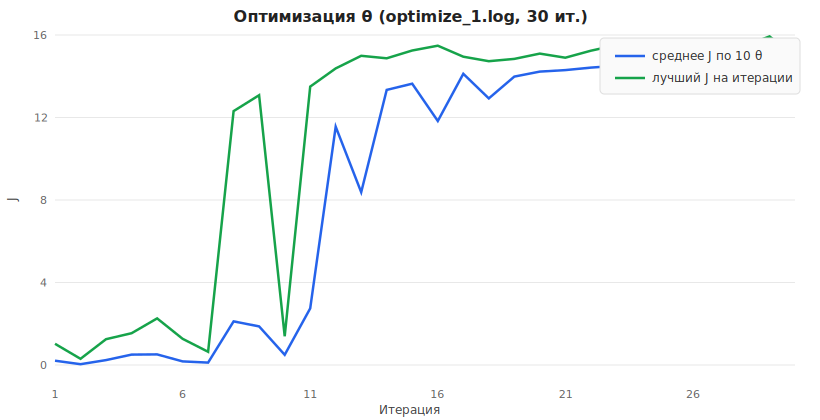

# Мета-оптимизация весов политики змейки (LLM + симуляция)

Документ описывает постановку задачи, метод, обоснование и результаты на примере прогона из лога [optimize_1.log](optimize_1.log). График построен по этому же логу: [docs/optimization_chart.svg](docs/optimization_chart.svg).

---

## 1. Постановка задачи

### 1.1. Управление змейкой

Политика — **линейная по признакам**: для каждого из четырёх направлений считается взвешенная сумма четырёх чисел, описывающих ход относительно поля и змеи. Выбирается направление с **наибольшей** суммой.

**Формула оценки хода** (одно число на кандидатный ход):

    score = w₁·(признак «еда») + w₂·(признак «опасность»)
          + w₃·(признак «пространство») + w₄·(признак «стена»)

Здесь **w₁…w₄** — четыре **настраиваемых веса** (то, что ищет оптимизация). Их удобно называть по смыслу: вес «к яблоку», «от опасности», «к свободному месту», «от стены» — но в симуляторе это просто четыре действительных числа, без отдельной формулы «из игры»: хорошие значения находятся перебором и проверкой в симуляции.

**Признаки** (четыре множителя в формуле) для каждого допустимого хода пересчитываются из текущего состояния поля; они описаны в разделе 2.7.

### 1.2. Целевая функция

Для фиксированного набора весов запускается много **независимых партий** (одна партия — одна полная игра до конца или до лимита шагов).

**Оценка одной партии** (скаляр **J**):

    J = (число собранных яблок) − (1, если змейка погибла; иначе 0)

То есть смерть штрафуется на **1** в тех же единицах, что и яблоки. Итоговая оценка весов — **среднее J** по многим партиям (в приложённом логе на каждый набор весов приходится **100** партий).

### 1.3. Что оптимизируем

Нужно **увеличить среднее J** по четырём весам в ситуации, когда:

- симуляция **дорогая**;
- цель **шумная** (разные партии дают разный исход);
- **нет аналитического градиента** — доступен только «запустил игру — получил число».

Пространство поиска четырёхмерное, но ландшафт нелинейный.

---

## 2. Метод

Используется **пошаговая чёрноящичная оптимизация с участием языковой модели**: на каждом шаге модель предлагает новые четвёрки весов по числовому отчёту о прошлых попытках, затем симулятор проверяет кандидатов.

### 2.1. Схема одной итерации

1. Держится **набор** из нескольких четвёрок весов (в типичном запуске столько же, сколько кандидатов запрашивается у модели за шаг, например **10**).
2. Для нужных четвёрок параллельно считается среднее **J** по заранее заданному числу партий на каждую.
3. В модель отправляется **структурированное описание** текущего состояния: кто лучше/хуже, средний уровень, расписание фазы, сжатая **траектория** прошлых оценок (см. ниже).
4. Модель возвращает столько же **новых** четвёрок весов в строгом машиночитаемом формате плюс короткое текстовое пояснение-гипотезу.
5. Следующий набор строится так: сначала берутся предложенные моделью уникальные векторы, затем при нехватке длины набора добираются **лучшие из уже известных** прошлой оценки; новые случайные веса после старта не подмешиваются.

### 2.2. Ускорение оценки

На шагах после начального **пересчитываются только те веса, которые модель впервые предложила на предыдущем шаге**; для уже известных четвёрок среднее **J** подставляется из памяти (по округлённым значениям весов). Экономия заметна, когда в наборе остаются «старые» веса; если модель каждый раз выдаёт полностью новый десяток при размере набора 10, фактически симулируются снова все десять — как в приложённом логе.

### 2.3. Компромисс между исследованием и эксплуатацией

**Исследование** (exploration) и **эксплуатация** (exploitation) — фундаментальный разрыв в оптимизации: с одной стороны, хочется опираться на уже найденные **перспективные** области пространства поиска и углублять удачные решения, с другой — **исследовать новые** области, чтобы не пропустить потенциально лучшие режимы весов.

Когда языковая модель выступает в роли оптимизатора, этот баланс задаётся явно: расписание фаз (сначала широкий охват, затем сдвиг к лучшим пробам, затем локальная доводка), отдельный режим при **застое** среднего балла, а также передача в запрос **лучших и худших** точек и **траектории** прошлых оценок — всё это подталкивает модель то к **эксплуатации** перспективных зон, то к **исследованию** далёких четвёрок весов, пока симулятор не подтвердит или не опровергнет гипотезу.

### 2.4. Промпты: что передаётся модели

Запрос состоит из **двух частей**.

**Системная часть** (фиксированный англоязычный текст): модель описывается как движок оптимизации четырёх весов змейки; ей предписано читать расписание фазы, списки лучших и худших точек, средний балл и траекторию прошлых оценок; по траектории искать закономерности среди более удачных весов; выдать **одно предложение** с гипотезой и затем ровно нужное число различных четвёрок; не дублировать кандидатов; ответить **только** валидным JSON без текста снаружи.

**Пользовательская часть** — один JSON с полями следующего смысла (имена полей в протоколе могут отличаться в коде; здесь важна роль):

| Смысл блока | Назначение |
|---------------|------------|
| Сколько лучших и худших показывать | Числа по умолчанию **5** и **5**: явные ориентиры «куда хорошо» и «куда плохо». |
| Списки лучших и худших | Четвёрки весов с их средним **J** после текущей оценки набора. |
| Средний балл по набору | Одно число — общий уровень качества текущих десяти весов. |
| Расписание шага | Номер итерации, всего итераций, **название фазы**, флаг «разрыв плато», короткая **англоязычная инструкция**, что именно сделать с кандидатами в этой фазе (см. п. 2.5). |
| Траектория | До **72** точек «итерация — веса — средний J» после сортировки и прорежки (подробнее в п. 2.6). |
| Постановка задачи | Напоминание: максимизировать яблоки с учётом штрафа за смерть. |
| Формат ответа | Напоминание: одна строка-гипотеза и ровно **N** различных четвёрок; использовать траекторию как контекст (в траектории баллы отсортированы по возрастанию). |

Ответ модели на стороне клиента дополнительно валидируется по схеме: обязательны и гипотеза, и полный список кандидатов фиксированной длины.

### 2.5. Фазы расписания и режим «плато»

Нормированный прогресс по номеру шага (от **0** на первой итерации до **1** на последней) считается так:

    прогресс = (номер_итерации − 1) / (число_итераций − 1)     при числе итераций > 1

Дальше действуют **пороги по доле пройденного цикла** (по умолчанию **34%** и **68%** от пути):

| Условие | Фаза (как в логе) | Что просят у модели по смыслу |
|---------|-------------------|-------------------------------|
| Сработал режим **«плато»** (см. ниже) — он **важнее** доли прогресса | отдельная фаза в духе «вырваться из застоя» | Дать **далеко разнесённые** четвёрки в четырёхмерном пространстве весов, не копировать почти одинаковые строки, не сбиваться в кучу у текущего лучшего, исследовать **другие квадранты**. |
| Иначе прогресс в **первой трети** пути | разведка | Кандидаты **сильно отличаются друг от друга**, покрывают пространство, не дублируют уже перечисленные точки. |
| Иначе прогресс в **средней трети** | крупный сдвиг к удаче | **Большие** изменения весов, смещённые к лучшим пробам и **от** худших; кучковаться только если всё явно улучшает балл. |
| Иначе | локальная доводка | **Малые** шаги вокруг лучшей четвёрки, сжать разведку. |

**Режим «плато»** включается, если по последним **четырём** шагам подряд средний **J** по всему текущему набору весов почти не меняется: разница между максимумом и минимумом из этих четырёх средних не превышает **0.2**. Тогда вместо обычной фазы по прогрессу в расписание подставляется режим «разорвать плато».

**Температура** запроса к модели: при плато выше (**0,92**), в обычном режиме ниже (**0,7**) — чтобы при застое выборка кандидатов была шире.

Для **30** итераций без плато типично получается: шаги **1–10** — разведка, **11–20** — крупные сдвиги, **21–30** — доводка.

### 2.6. Буфер траектории

После каждой оценки набора в память добавляется по записи **на каждую** оценённую четвёрку весов: номер шага (с единицы), сами веса, средний **J**.

- Хранится **не больше последних 320** таких записей — старые отбрасываются.
- В запрос модели попадает **не больше 72** точек: сначала все накопленные кандидаты сортируются по **J от худшего к лучшему**, затем при переполнении выполняется **равномерная прорежка по рангу**, чтобы уложиться в лимит **72**.

Строка лога вроде «траектория в промпт: **72** точек (буфер **80**…)» значит: в памяти уже **80** записей, а в JSON ушло **72** после ограничения на размер траектории.

### 2.7. Веса и признаки: кто как считается

**Веса w₁…w₄** не вычисляются формулой из кода игры — их подбирает оптимизация (модель предлагает, симулятор проверяет). На протяжении одной партии веса **фиксированы**: они не меняются от шага к шагу.

**Признаки** на каждом шаге партии **зависят только от ситуации на поле и от выбранного кандидатного хода**, а **не от весов**. Веса лишь задают, насколько «важна» каждая из четырёх величин при сравнении ходов. Конкретно в числа входят: размер поля, где голова и тело змеи, где яблоко, съедим ли яблоко этим ходом (рост змеи), какой будет новая конфигурация змеи и клеток вокруг новой головы. От одного и того же набора весов итог партии всё равно разный, потому что признаки на каждом шаге новые — меняется поле, длина змеи и т.д.

Для **каждого разрешённого** направления сначала мысленно делается шаг: где окажется голова и какой будет змея после него (если наступили на яблоко — змея вырастает на одну клетку). Дальше из этой **будущей** картины считаются четыре отдельных числа — признака.

**1. Признак «к яблоку».** Считается городское расстояние от **новой** головы до яблока (сколько шагов только вверх/вниз/влево/вправо). Берётся это расстояние со знаком **минус**: чем ближе яблоко, тем **больше** получается число (минус маленького расстояния ближе к нулю, чем минус большого). Если яблока на поле нет, признак обнуляется. Затем число делится на сумму сторон поля, чтобы на разных размерах поля величины были сопоставимы.

**2. Признак «от опасности».** Смотрят четыре клетки, которые **соседствуют по стороне** с новой головой (вверх, вниз, влево, вправо). За каждую ситуацию «сосед — за краем поля» добавляется крупный штраф; за соседа с **телом** змеи — меньший штраф. Клетка **хвоста** в штраф не входит, если после хода хвост как раз освобождается и змея туда не врежется (иначе хвост считается как препятствие). Все штрафы складываются; в признак идёт **минус** от этой суммы: чем спокойнее соседи, тем **больше** число.

**3. Признак «свободное место».** От **новой** головы в ширину обходят только **пустые** клетки: можно идти в четыре стороны, но нельзя заходить на клетки, которые займет змея **уже после** этого хода. Так считается, сколько клеток «доступно», если считать, что хвост мог освободиться и дорога открылась. Полученное количество делится на площадь поля (число всех клеток), чтобы получить долю от 0 до 1 в духе «насколько просторно вокруг».

**4. Признак «до стены».** Считаются четыре расстояния по сетке от новой головы до верхней, нижней, левой и правой стенки (только шаги вверх, вниз, влево, вправо, без диагоналей). В признак берётся **наименьшее** из этих четырёх: насколько близко голова к ближайшему краю поля. У самой стенки одно из значений будет нулем.

Если ход **нельзя** сделать (выход за поле, врезание в тело там, где клетка не освобождается), это направление **не участвует** в выборе лучшего хода.

---

## 3. Обоснование выбора метода

| Критерий | Почему связка «модель + симуляция», а не только классический численный оптимизатор |
|----------|--------------------------------------------------------------------------------------|
| Чёрный ящик | Цель задаётся прогоном игры; производная по весам недоступна. |
| Шум | Один замер среднего по малому числу партий ненадёжен; имеет смысл наращивать число партий для финальной проверки лучших точек. |
| Интерпретируемость | Модель даёт короткую **гипотезу шага** и осмысленные кластеры кандидатов — удобно для отчёта. |
| Низкая размерность | Четыре числа — объём, где «умный» поиск с памятью о прошлых оценках часто работает без тяжёлого суррогатного моделирования. |
| Параллелизм | Партии независимы — хорошо грузят несколько ядер процессора. |

Классические методы (эволюционные стратегии, байесовская оптимизация и др.) не исключены. Описанный здесь способ **не претендует** превзойти по скорости, точности или теоретическим гарантиям современные **градиентные** процедуры и узкоспециализированные **математические** методы оптимизации: там, где известны производные, выпуклость или устойчивые суррогаты, они остаются опорной линией.

Вместе с тем **крупные языковые модели** при удачной **подсказке** (роль системы, расписание фаз, таблицы лучших и худших, траектория оценок) могут вести поиск по **разным** чёрноящичным целевым функциям без явного градиента. Для **некоторых небольших** задач с малым числом параметров в практике встречаются случаи, когда удаётся выйти на решение **уровня глобального оптимума** в рамках постановки и бюджета симуляций — с оговоркой, что это **эмпирический** эффект, а не универсальная гарантия: итог зависит от модели, шума оценки и числа партий.

Текущий подход — **компромисс**: задействовать гибкость модели и человекочитаемый контекст ценой вызовов внешнего API и без формальных доказательств сходимости.

---

## 4. Результаты (прогон optimize_1.log)

**Условия прогона:** 30 итераций, поле 10×10, до 1000 шагов за партию, **100** партий на каждую четвёрку весов, **10** активных наборов весов на итерацию, **10** параллельных рабочих процессов.

### 4.1. График

- **Синяя линия** — среднее **J** по десяти четвёркам после оценки на шаге.  
- **Зелёная линия** — лучший **J** среди этих десяти.

Видна длительная разведка с низким средним (шаги 1–7), затем резкий рост (шаг 8: лучший **J** ≈ 12,3), дальше стабилизация в фазах крупного сдвига и доводки с лучшим **J** порядка **14–16**.

### 4.2. Численная сводка

| Показатель | Значение |
|------------|----------|
| Максимум лучшего **J** за весь прогон | **15,93** (шаг 29), веса примерно [6,15; −0,07; −6,15; 0,07] |
| Лучшая четвёрка на **последнем** шаге | **J** = **14,95**, веса [6,154; −0,065; −6,144; 0,072] |
| Среднее **J** по десяти четвёркам на последнем шаге | **14,568** |
| Устойчивый паттерн у сильных решений | крупные противоположные первый и третий веса, малые второй и четвёртый с противоположным знаком |

### 4.3. Интерпретация

1. Оптимизация вывела политику на **высокий уровень** среднего **J** (порядка пятнадцати яблок за партию в среднем с учётом штрафа за смерть в типичных условиях прогона).
2. Разница между пиком на **29-м** шаге и финалом на **30-м** показывает **случайность** оценки при 100 партиях: для отчёта о «истинно» лучшей четвёрке разумно сделать отдельный длинный прогон.
3. В этом логе на каждом шаге симулировались **все десять** новых предложений модели (остальные ноль из кэша), то есть кэш почти не сокращал работу; он полезнее, когда часть набора повторяется между шагами.

---

## 5. График по обновлённому логу

Если вы сохранили новый лог того же формата, SVG-график можно пересобрать вспомогательным сценарием разбора лога в каталоге **scripts** (тот же формат строк «среднее J…» и «лучший вариант…») с записью в **docs/optimization_chart.svg**.

---

## 6. Состав решения (без привязки к файлам)

- **Игра и симулятор партий** — детерминированный шаг с учётом правил поля.  
- **Политика змейки** — выбор хода по четырём признакам и четырём весам.  
- **Цикл оптимизации** — оценка наборов весов, память уже увиденных весов, вызов модели, сбор следующего набора.  
- **Промпты и расписание фаз** — задают стиль поиска на ранних, средних и поздних шагах и при застое среднего балла.  
- **Клиент к API модели** — отправка двухчастного запроса и разбор строгого JSON-ответа.
